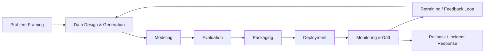

# ML Lifecycle Mapping

## Overview
This document maps the end-to-end ML lifecycle for incident ticket triage as an engineering system:
**Problem framing → Data → Modeling → Evaluation → Packaging → Deployment → Monitoring → Feedback loops**

The goal is to make decisions traceable and operationally safe (especially for high-impact incidents like P0/P1).

---

## Lifecycle Flow (Diagram)

